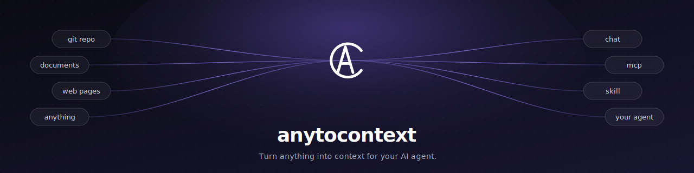

<div align="center">



# anytocontext

**Community Edition**

Turn anything into information your agent can query directly. Package any
data you want to expose through a flexible visual build workflow, then let
an agent answer natural-language questions over it.

[Website](https://anytocontext.com) · [English](./README.md) · [简体中文](./README.zh-CN.md)

<p>
  <strong><a href="https://anytocontext.com">🚀 Try the hosted version</a></strong>
</p>

</div>

---

## Overview

Through a custom build pipeline, anytocontext turns anything — a code
repository, a webpage, any content you care about — into a file-system-
based knowledge base. Your agent reads from it directly, or visitors call
the agent through a chat box embedded on a webpage.

**Why this exists.** Sometimes you need to share part of your data with
others, but exposing the raw source material is too risky. anytocontext
lets you configure data-cleaning and redaction steps during the build, so
only the content that is safe to publish becomes queryable agent
knowledge. Others can get the authorized knowledge by talking to your
agent directly, without touching the original data.

## Use cases

- **Share documentation with your team.** Package internal docs, runbooks,
  or knowledge bases once, then let teammates query them in natural
  language without hunting through wikis.
- **Expose a curated slice of your codebase.** Pick exactly which parts of
  a repository can be shared, then give the rest of the team an agent that
  can answer "how does this business rule work?" without granting full
  source-code access.

## Hosted version

Don't want to run your own stack? Try the hosted version at
<https://anytocontext.com>. Sign up and start using it right away — no
agent worker to deploy, no R2 / Postgres / Clerk to wire up. Create
projects, run builds, and connect MCP clients out of the box.

## Cloud services required

| Service | Why |
| --- | --- |
| **Cloudflare Workers + Durable Objects + Containers** | Hosts the agent worker (`cloudflare/agent-worker`). Sandboxes data builds and agent runs inside per-task containers. Required. |
| **Cloudflare R2** | Stores build logs and workspace snapshots (the source of context for every agent run). Required. |
| **Postgres** (Neon, Supabase, RDS, self-hosted, ...) | Application database (projects, credentials, API keys, build/query history). Required. |
| **Clerk** | User authentication. Required (you can swap it for any auth provider with code changes). |
| **An OpenAI-compatible LLM API** | The agent's brain. You bring your own key and base URL. Required. |

## Local development

Prerequisites: Node.js 20+, [pnpm](https://pnpm.io/), Cloudflare account
with R2 enabled, a Postgres database, Clerk dev keys.

```bash
# 1) Install deps (postinstall auto-runs `prisma generate`)
pnpm install

# 2) Configure env
cp env.example .env                                # main Next.js app
cp cloudflare/agent-worker/env.example \
   cloudflare/agent-worker/.dev.vars               # agent worker secrets
# fill in real values in both files

# 3) Apply database schema
pnpm prisma:migrate:dev

# 4) Start the agent worker (port 8790 by default)
cd cloudflare/agent-worker && pnpm wrangler dev --env dev

# 5) In another terminal, start the main app (port 3000)
pnpm dev
```

Then open <http://localhost:3000>.

## Deploying

The two pieces deploy independently:

1. **Agent worker** — from `cloudflare/agent-worker/`, edit
   `wrangler.jsonc` (replace the `REPLACE_WITH_YOUR_*` placeholders with
   your real R2 bucket name, account ID, and your production app's base
   URL), then:

   ```bash
   pnpm wrangler secret put INTERNAL_API_SECRET --env prod
   pnpm wrangler secret put R2_ACCESS_KEY_ID    --env prod
   pnpm wrangler secret put R2_SECRET_ACCESS_KEY --env prod
   pnpm wrangler secret put OPENAI_BASE_URL     --env prod
   pnpm wrangler secret put OPENAI_API_KEY      --env prod
   pnpm wrangler secret put OPENAI_MODEL        --env prod
   pnpm wrangler deploy --env prod
   ```

2. **Next.js app** — deploy to Vercel, Cloudflare Pages, Fly.io, your own
   Node host, anything that runs Next.js 16. Set every variable from
   `env.example` in the deploy platform; in particular point
   `SANDBOX_WORKER_URL` at the deployed agent worker and use the same
   `INTERNAL_API_SECRET` on both sides. Run `pnpm prisma:migrate:deploy`
   against the production database during release.

## Tech stack

Next.js 16 (App Router) · React 19 · TypeScript · Tailwind 4 · shadcn/ui ·
Prisma 7 · Clerk · `@xyflow/react` · Cloudflare Workers / Durable Objects /
Containers / R2 · `@cloudflare/sandbox` · `@modelcontextprotocol/sdk` ·
OpenAI SDK (OpenAI-compatible).

## License

See [LICENSE](./LICENSE).
